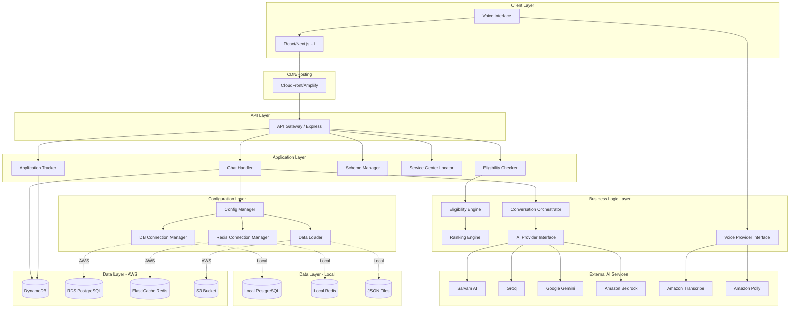

# Design Document: Sahayak AI – Voice-First Government Scheme Assistant

## Overview

Sahayak AI is a serverless, voice-first AI assistant that helps Indian citizens discover and apply for government welfare schemes through natural language conversation. The system is designed for accessibility, targeting low-literacy users through voice interaction and simple conversational interfaces.

### Design Goals

1. **Accessibility First**: Voice-first design with fallback to text, supporting Hindi and English
2. **Serverless Architecture**: AWS Lambda-based backend for scalability and cost efficiency
3. **Modular AI/Voice Providers**: Pluggable interfaces for easy provider switching
4. **Low Latency**: Sub-500ms response times with caching and optimized data access
5. **Resilience**: Graceful degradation with fallback mechanisms for all external dependencies
6. **Cost Optimization**: Response caching, efficient AI model selection, and pay-per-use infrastructure

### Technology Stack

**Frontend:**
- React 18 with Next.js 14 (App Router)
- Tailwind CSS for styling
- Web Speech API for browser-based voice I/O
- React Query for state management and caching

**Backend (Dual-Environment Support):**
- Node.js 20.x runtime (Express server for local, Lambda for AWS)
- Automatic environment detection via NODE_ENV
- Local Development: PostgreSQL, Redis, Filesystem
- AWS Production: RDS PostgreSQL, ElastiCache Redis, S3
- Centralized configuration system (`backend/src/config/index.ts`)

**Data Layer:**
- **Local Development:**
  - PostgreSQL (localhost:5432)
  - Redis (localhost:6379)
  - JSON files (./data/)
- **AWS Production:**
  - AWS RDS PostgreSQL (schemes, eligibility rules)
  - AWS ElastiCache Redis (response caching)
  - AWS S3 (JSON data, static assets)
  - AWS DynamoDB (chat sessions, applications)

**AI/Voice Services:**
- Sarvam AI (primary, Hindi-optimized)
- Groq (secondary fallback)
- Google Gemini (tertiary fallback)
- Amazon Bedrock (optional, AWS-only)
- Amazon Transcribe (speech-to-text, AWS-only)
- Amazon Polly (text-to-speech, AWS-only)
- Web Speech API (browser-based alternative)

**Deployment:**
- Local: npm run dev (localhost:3001)
- AWS: Lambda + API Gateway OR EC2 + PM2
- Frontend: AWS Amplify or S3 + CloudFront
- Infrastructure as Code: AWS CDK or Terraform (optional)


## Architecture

### Dual-Environment Architecture Overview

The system supports **BOTH** local development and AWS production using the **same codebase**. Environment switching is automatic based on `NODE_ENV`.

**Local Development:**
```
┌─────────────────────────────────────┐
│   Developer Laptop                  │
│                                     │
│  ┌──────────────┐                  │
│  │  Node.js App │                  │
│  │  (Express)   │                  │
│  └──────┬───────┘                  │
│         │                           │
│    ┌────┴────┬────────┬──────┐    │
│    │         │        │      │    │
│  ┌─▼──┐  ┌──▼──┐  ┌──▼─┐  ┌─▼─┐  │
│  │ PG │  │Redis│  │JSON│  │AI │  │
│  │SQL │  │     │  │File│  │API│  │
│  └────┘  └─────┘  └────┘  └───┘  │
│                                     │
└─────────────────────────────────────┘
```

**AWS Production:**
```
┌──────────────────────────────────────────┐
│           AWS Cloud                      │
│                                          │
│  ┌────────────────┐                     │
│  │  API Gateway   │                     │
│  └────────┬───────┘                     │
│           │                              │
│  ┌────────▼────────┐                    │
│  │  Lambda/EC2     │                    │
│  │  (Node.js App)  │                    │
│  └────┬────┬───┬───┘                    │
│       │    │   │                         │
│   ┌───▼┐ ┌─▼──┐ ┌▼──┐                  │
│   │RDS │ │Elasti│ │S3│                  │
│   │(PG)│ │Cache│ │   │                  │
│   └────┘ └─────┘ └───┘                  │
│                                          │
└──────────────────────────────────────────┘
```

### High-Level System Architecture



### Architecture Principles

1. **Dual-Environment Support**: Same codebase runs locally and on AWS with automatic environment detection
2. **Configuration-Driven**: Central config system (`backend/src/config/index.ts`) manages all environment-specific settings
3. **API-Driven**: Clear separation between frontend and backend through REST APIs
4. **Provider Abstraction**: Modular interfaces for AI, voice, database, and storage services
5. **Data Separation**: PostgreSQL for relational scheme data, Redis for caching, DynamoDB for sessions (AWS only)
6. **Stateless Handlers**: All handlers are stateless; state stored in databases
7. **Graceful Degradation**: Fallback mechanisms at every external dependency
8. **Cost Optimization**: Local development uses free tools; AWS uses Free Tier resources


## Configuration System

### Environment Detection and Configuration Loading

The system uses a centralized configuration manager (`backend/src/config/index.ts`) that automatically detects the environment and loads appropriate settings.

**Environment Detection:**
```typescript
const env = process.env.NODE_ENV || 'development';
const envFile = env === 'production' ? '.env.production' : '.env.local';
```

**Configuration Structure:**
```typescript
interface AppConfig {
  env: 'development' | 'production' | 'test';
  port: number;
  database: DatabaseConfig;    // PostgreSQL settings
  redis: RedisConfig;          // Redis settings
  dataStorage: StorageConfig;  // Local filesystem or S3
  aws?: AWSConfig;             // AWS credentials (production only)
  ai: AIConfig;                // AI provider settings
}
```

### Environment-Specific Configuration Files

**`.env.local` (Development):**
```env
NODE_ENV=development
PORT=3001

# Local PostgreSQL
DB_HOST=localhost
DB_PORT=5432
DB_NAME=sahayak_db
DB_USER=postgres
DB_PASSWORD=your_password

# Local Redis
REDIS_HOST=localhost
REDIS_PORT=6379

# Local Data Storage
DATA_PATH=./data

# AI Provider Keys
GEMINI_API_KEY=your_key
SARVAM_API_KEY=your_key
GROQ_API_KEY=your_key
```

**`.env.production` (AWS):**
```env
NODE_ENV=production
PORT=3001

# AWS RDS PostgreSQL
DB_HOST=sahayak-db.xxxxx.ap-south-1.rds.amazonaws.com
DB_PORT=5432
DB_NAME=sahayak_production
DB_USER=admin
DB_PASSWORD=your_rds_password

# AWS ElastiCache Redis
REDIS_HOST=sahayak-redis.xxxxx.cache.amazonaws.com
REDIS_PORT=6379
REDIS_PASSWORD=your_password

# AWS S3
S3_BUCKET=sahayak-data-bucket
S3_REGION=ap-south-1

# AWS Credentials
AWS_REGION=ap-south-1
AWS_ACCESS_KEY_ID=your_key
AWS_SECRET_ACCESS_KEY=your_secret

# AI Provider Keys
GEMINI_API_KEY=your_key
SARVAM_API_KEY=your_key
GROQ_API_KEY=your_key
```

### Configuration-Driven Components

#### 1. Database Connection Manager
**File**: `backend/src/db/connection.ts`

Automatically connects to the appropriate database based on environment:

```typescript
import { getDatabase } from './db/connection';

// Automatically connects to:
// - Local PostgreSQL (development)
// - AWS RDS with SSL (production)

const db = getDatabase();
const result = await db.query('SELECT * FROM schemes');
```

**Features:**
- SSL enabled automatically in production
- Connection pooling (5 local, 20 production)
- Auto-reconnect on failure
- Health check support

#### 2. Redis Connection Manager
**File**: `backend/src/db/redis-client.ts`

Automatically connects to the appropriate Redis instance:

```typescript
import { getRedisClient } from './db/redis-client';

// Automatically connects to:
// - Local Redis (development)
// - AWS ElastiCache with TLS (production)

const redis = getRedisClient();
await redis.set('key', 'value');
```

**Features:**
- TLS enabled automatically in production
- Retry strategy with exponential backoff
- Connection pooling
- Health check support

#### 3. Data Loader
**File**: `backend/src/utils/data-loader.ts`

Automatically loads data from the appropriate source:

```typescript
import { loadSchemesData, loadServiceCentersData } from './utils/data-loader';

// Automatically loads from:
// - ./data/schemes.json (development)
// - s3://sahayak-data-bucket/schemes.json (production)

const schemes = await loadSchemesData();
const centers = await loadServiceCentersData();
```

**Features:**
- Automatic source detection (filesystem vs S3)
- In-memory caching (5 min TTL)
- Error handling and retries
- Support for JSON parsing

### Configuration Usage Pattern

All components follow this pattern:

```typescript
import { config } from '../config';

// Use config values instead of hardcoded settings
const dbHost = config.database.host;
const useSSL = config.database.ssl;
const storageType = config.dataStorage.type;

// Configuration automatically adapts to environment
if (config.env === 'production') {
  // Production-specific logic
} else {
  // Development-specific logic
}
```


## Components and Interfaces

### Frontend Components

#### 1. Chat Interface Component
**Responsibility**: Manages the conversational UI and message display

**Key Features:**
- Message history display with user/assistant differentiation
- Text input with send button
- Voice input activation button
- Auto-scroll to latest message
- Loading indicators during AI response generation
- Language selector (Hindi/English)

**State Management:**
- Chat session ID
- Message history array
- Current user input
- Loading state
- Selected language

#### 2. Voice Interaction Component
**Responsibility**: Handles voice input/output through configured provider

**Key Features:**
- Microphone activation/deactivation
- Real-time audio level visualization
- Speech-to-text conversion status
- Text-to-speech playback controls (pause/resume/stop)
- Error handling for voice service failures

**Provider Interface:**
```typescript
interface VoiceProvider {
  startRecording(): Promise<void>;
  stopRecording(): Promise<string>; // Returns transcribed text
  synthesizeSpeech(text: string, language: string): Promise<AudioBuffer>;
  isAvailable(): boolean;
}
```

**Implementations:**
- `WebSpeechProvider`: Uses browser Web Speech API
- `AWSVoiceProvider`: Uses Amazon Transcribe + Polly

#### 3. Scheme Explorer Component
**Responsibility**: Displays browsable scheme catalog with filtering

**Key Features:**
- Scheme cards with name, description, benefits
- Category-based grouping
- Filter controls (state, category, beneficiary type)
- Keyword search
- Detailed scheme view modal

#### 4. Service Center Locator Component
**Responsibility**: Displays nearby service centers on a map

**Key Features:**
- Map integration (OpenStreetMap or Google Maps)
- Service center markers with info windows
- List view with distance sorting
- Contact information display
- Operating hours

#### 5. Application Tracker Component
**Responsibility**: Shows user's application status and progress

**Key Features:**
- Application list with status badges
- Progress indicators (percentage complete)
- Step-by-step workflow display
- Document checklist
- Resume application functionality


### Backend Components

#### 1. Conversation Orchestrator
**Responsibility**: Manages chat flow, context, and AI interactions

**Core Functions:**
```typescript
class ConversationOrchestrator {
  async processMessage(
    sessionId: string,
    userMessage: string,
    language: string
  ): Promise<AssistantResponse>;
  
  async extractUserProfile(
    sessionId: string,
    conversationHistory: Message[]
  ): Promise<UserProfile>;
  
  async identifyMissingInfo(
    profile: UserProfile
  ): Promise<string[]>;
  
  async generateFollowUpQuestion(
    missingFields: string[]
  ): Promise<string>;
}
```

**Key Responsibilities:**
- Route messages to AI provider
- Maintain conversation context
- Extract structured data from natural language
- Identify missing eligibility information
- Generate contextual follow-up questions
- Manage session state in DynamoDB

**Context Management:**
- Stores last 10 messages in session for context
- Tracks collected user profile attributes
- Maintains conversation stage (greeting, info collection, eligibility check, guidance)

#### 2. AI Provider Interface
**Responsibility**: Abstract interface for multiple AI providers

**Interface Definition:**
```typescript
interface AIProvider {
  generateResponse(
    prompt: string,
    context: Message[],
    language: string,
    systemPrompt?: string
  ): Promise<AIResponse>;
  
  extractStructuredData(
    text: string,
    schema: JSONSchema
  ): Promise<object>;
  
  isAvailable(): Promise<boolean>;
}

interface AIResponse {
  text: string;
  confidence: number;
  tokensUsed: number;
}
```

**Implementations:**
- `BedrockProvider`: Amazon Bedrock (Nova Lite or Claude 3 Haiku)
- `GeminiProvider`: Google Gemini API

**Provider Selection Logic:**
1. Try primary provider (configured in environment)
2. On failure, retry with exponential backoff (3 attempts)
3. Fall back to secondary provider
4. Return error if all providers fail

**System Prompts:**
- Scheme discovery prompt: Guides AI to ask relevant questions
- Eligibility extraction prompt: Structures user info into profile
- Application guidance prompt: Provides step-by-step instructions


#### 3. Eligibility Engine
**Responsibility**: Evaluates user profiles against scheme eligibility rules

**Core Algorithm:**
```typescript
class EligibilityEngine {
  async evaluateEligibility(
    userProfile: UserProfile,
    schemes: Scheme[]
  ): Promise<EligibilityResult[]>;
  
  private matchesCriteria(
    userProfile: UserProfile,
    criteria: EligibilityCriteria
  ): boolean;
  
  private matchCategorical(
    userValue: string,
    criteriaValue: string | string[]
  ): boolean;
  
  private matchNumeric(
    userValue: number,
    criteriaRange: { min?: number; max?: number }
  ): boolean;
}
```

**Matching Rules:**
- **Categorical Attributes** (state, gender, caste, occupation): Exact match or "ANY"
- **Numeric Attributes** (age, income): Range-based matching with min/max bounds
- **Boolean Attributes** (disability): Direct boolean comparison
- **Missing Attributes**: Treated as non-matching unless criteria allows null

**Evaluation Process:**
1. Load all schemes from RDS (with Redis caching)
2. For each scheme, check all eligibility criteria
3. Mark scheme as eligible only if ALL criteria match
4. Return list of eligible schemes with match details

**Performance Optimization:**
- Cache scheme data in Redis (24-hour TTL)
- Use database indexes on frequently queried fields
- Parallel evaluation for independent schemes
- Target: Complete evaluation in < 2 seconds for 1000+ schemes

#### 4. Ranking Engine
**Responsibility**: Prioritizes eligible schemes by relevance

**Ranking Algorithm:**
```typescript
class RankingEngine {
  rankSchemes(
    eligibleSchemes: Scheme[],
    userProfile: UserProfile
  ): RankedScheme[];
  
  private calculateRelevanceScore(
    scheme: Scheme,
    userProfile: UserProfile
  ): number;
}
```

**Scoring Factors:**
1. **Occupation Match** (30 points): Scheme targets user's occupation
2. **State Match** (25 points): Scheme is state-specific and matches user state
3. **Benefit Value** (20 points): Higher monetary benefits score higher
4. **Category Priority** (15 points): Certain categories (health, education) prioritized
5. **Recency** (10 points): Newer schemes ranked higher

**Score Calculation:**
```
Total Score = (occupation_match * 30) + 
              (state_match * 25) + 
              (benefit_value_normalized * 20) + 
              (category_priority * 15) + 
              (recency_score * 10)
```

**Output:** Sorted list of schemes with relevance scores (0-100)


#### 5. Voice Provider Interface
**Responsibility**: Abstract interface for speech services

**Interface Definition:**
```typescript
interface VoiceProvider {
  speechToText(
    audioData: Buffer,
    language: string
  ): Promise<string>;
  
  textToSpeech(
    text: string,
    language: string,
    voiceId?: string
  ): Promise<AudioBuffer>;
  
  getSupportedLanguages(): string[];
}
```

**Implementations:**
- `WebSpeechProvider`: Browser-based (client-side only)
- `AWSTranscribeProvider`: Amazon Transcribe for STT
- `AWSPollyProvider`: Amazon Polly for TTS

**Language Configuration:**
- Hindi: `hi-IN` (Transcribe), `Aditi` voice (Polly)
- English: `en-IN` (Transcribe), `Raveena` voice (Polly)

#### 6. Service Center Locator
**Responsibility**: Finds and displays nearby service centers

**Core Functions:**
```typescript
class ServiceCenterLocator {
  async findByDistrict(
    district: string,
    state: string
  ): Promise<ServiceCenter[]>;
  
  async findNearby(
    latitude: number,
    longitude: number,
    radiusKm: number
  ): Promise<ServiceCenter[]>;
  
  private calculateDistance(
    lat1: number,
    lon1: number,
    lat2: number,
    lon2: number
  ): number; // Haversine formula
}
```

**Data Source:**
- Service center data stored in RDS PostgreSQL
- Geocoded coordinates for distance calculations
- Fallback to neighboring districts if no centers found

**Map Integration:**
- Primary: OpenStreetMap with Leaflet.js (free, no API key)
- Alternative: Google Maps API (requires API key)
- Display markers with info popups
- Show directions link to external maps app

#### 7. Scheme Dataset Manager
**Responsibility**: Imports and synchronizes scheme data

**Import Process:**
```typescript
class SchemeDatasetManager {
  async importFromCSV(s3Key: string): Promise<ImportResult>;
  
  async validateSchemeData(schemes: Scheme[]): Promise<ValidationResult>;
  
  async syncToDatabase(schemes: Scheme[]): Promise<void>;
  
  async invalidateCache(): Promise<void>;
}
```

**CSV Format:**
```csv
scheme_id,name,name_hi,description,description_hi,category,state,eligibility_age_min,eligibility_age_max,eligibility_gender,eligibility_income_max,eligibility_caste,eligibility_occupation,benefit_amount,benefit_type,application_steps,required_documents
```

**Import Workflow:**
1. Upload CSV to S3 bucket
2. Lambda triggered by S3 event
3. Parse and validate CSV data
4. Upsert schemes into RDS PostgreSQL
5. Invalidate Redis cache
6. Log import results

**Validation Rules:**
- Required fields: scheme_id, name, description, category
- Numeric fields: age_min <= age_max, income_max >= 0
- Enum validation: category, state, gender, caste
- Duplicate scheme_id detection


## Data Models

### DynamoDB Tables

#### ChatSessions Table
**Purpose**: Store conversation history and user context

**Schema:**
```typescript
interface ChatSession {
  sessionId: string;           // Partition Key (UUID)
  userId: string;              // GSI Partition Key
  createdAt: number;           // Timestamp (epoch ms)
  updatedAt: number;           // Timestamp (epoch ms)
  language: 'hi' | 'en';
  messages: Message[];
  userProfile: UserProfile;
  stage: 'greeting' | 'info_collection' | 'eligibility_check' | 'guidance';
  ttl: number;                 // Auto-delete after 90 days
}

interface Message {
  role: 'user' | 'assistant';
  content: string;
  timestamp: number;
  metadata?: {
    voiceInput?: boolean;
    confidence?: number;
  };
}
```

**Indexes:**
- Primary Key: `sessionId`
- GSI: `userId-createdAt-index` for user session history
- TTL: `ttl` field for automatic cleanup

**Access Patterns:**
- Get session by ID: `GetItem(sessionId)`
- Get user sessions: `Query(userId, SortKey=createdAt)`
- Update session: `UpdateItem(sessionId)`

#### Applications Table
**Purpose**: Track user scheme applications

**Schema:**
```typescript
interface Application {
  applicationId: string;       // Partition Key (UUID)
  userId: string;              // GSI Partition Key
  schemeId: string;
  schemeName: string;
  status: 'draft' | 'in_progress' | 'submitted' | 'approved' | 'rejected';
  progress: number;            // 0-100 percentage
  currentStep: number;
  totalSteps: number;
  completedSteps: string[];
  submittedAt?: number;
  createdAt: number;
  updatedAt: number;
  ttl: number;                 // Auto-delete after 2 years
}
```

**Indexes:**
- Primary Key: `applicationId`
- GSI: `userId-createdAt-index` for user applications
- TTL: `ttl` field

**Access Patterns:**
- Get application: `GetItem(applicationId)`
- Get user applications: `Query(userId, SortKey=createdAt)`
- Update application: `UpdateItem(applicationId)`


### RDS PostgreSQL Schema

#### schemes Table
**Purpose**: Store government scheme information

```sql
CREATE TABLE schemes (
  scheme_id VARCHAR(100) PRIMARY KEY,
  name VARCHAR(500) NOT NULL,
  name_hi VARCHAR(500),
  description TEXT NOT NULL,
  description_hi TEXT,
  category VARCHAR(100) NOT NULL,
  state VARCHAR(100),
  eligibility_age_min INTEGER,
  eligibility_age_max INTEGER,
  eligibility_gender VARCHAR(20),
  eligibility_income_max DECIMAL(12,2),
  eligibility_caste VARCHAR(50),
  eligibility_occupation VARCHAR(100),
  eligibility_disability BOOLEAN,
  benefit_amount DECIMAL(12,2),
  benefit_type VARCHAR(100),
  application_url TEXT,
  created_at TIMESTAMP DEFAULT CURRENT_TIMESTAMP,
  updated_at TIMESTAMP DEFAULT CURRENT_TIMESTAMP
);

CREATE INDEX idx_schemes_category ON schemes(category);
CREATE INDEX idx_schemes_state ON schemes(state);
CREATE INDEX idx_schemes_occupation ON schemes(eligibility_occupation);
```

#### application_workflows Table
**Purpose**: Store step-by-step application processes

```sql
CREATE TABLE application_workflows (
  workflow_id SERIAL PRIMARY KEY,
  scheme_id VARCHAR(100) REFERENCES schemes(scheme_id),
  step_number INTEGER NOT NULL,
  step_title VARCHAR(500) NOT NULL,
  step_title_hi VARCHAR(500),
  step_description TEXT NOT NULL,
  step_description_hi TEXT,
  required_documents JSONB,
  estimated_time_minutes INTEGER,
  UNIQUE(scheme_id, step_number)
);

CREATE INDEX idx_workflows_scheme ON application_workflows(scheme_id);
```

#### service_centers Table
**Purpose**: Store physical service center locations

```sql
CREATE TABLE service_centers (
  center_id SERIAL PRIMARY KEY,
  name VARCHAR(500) NOT NULL,
  name_hi VARCHAR(500),
  address TEXT NOT NULL,
  address_hi TEXT,
  district VARCHAR(100) NOT NULL,
  state VARCHAR(100) NOT NULL,
  pincode VARCHAR(10),
  phone VARCHAR(20),
  email VARCHAR(100),
  latitude DECIMAL(10,8),
  longitude DECIMAL(11,8),
  operating_hours JSONB,
  services_offered JSONB,
  created_at TIMESTAMP DEFAULT CURRENT_TIMESTAMP
);

CREATE INDEX idx_centers_district ON service_centers(district, state);
CREATE INDEX idx_centers_location ON service_centers USING GIST(
  ll_to_earth(latitude, longitude)
);
```

### TypeScript Data Models

#### UserProfile
```typescript
interface UserProfile {
  age?: number;
  gender?: 'male' | 'female' | 'other';
  occupation?: string;
  state?: string;
  district?: string;
  income?: number;              // Annual income in INR
  casteCategory?: 'general' | 'obc' | 'sc' | 'st';
  hasDisability?: boolean;
  completeness: number;         // 0-100 percentage
}
```

#### Scheme
```typescript
interface Scheme {
  schemeId: string;
  name: string;
  nameHi?: string;
  description: string;
  descriptionHi?: string;
  category: string;
  state?: string;
  eligibility: EligibilityCriteria;
  benefit: {
    amount?: number;
    type: string;
  };
  applicationUrl?: string;
}

interface EligibilityCriteria {
  ageMin?: number;
  ageMax?: number;
  gender?: string | string[];
  incomeMax?: number;
  caste?: string | string[];
  occupation?: string | string[];
  disability?: boolean;
}
```

#### ServiceCenter
```typescript
interface ServiceCenter {
  centerId: number;
  name: string;
  nameHi?: string;
  address: string;
  addressHi?: string;
  district: string;
  state: string;
  pincode?: string;
  phone?: string;
  email?: string;
  location?: {
    latitude: number;
    longitude: number;
  };
  operatingHours?: {
    [day: string]: { open: string; close: string };
  };
  servicesOffered?: string[];
  distance?: number;            // Calculated field (km)
}
```


### Caching Strategy

#### Redis Cache Structure

**Scheme Data Cache:**
```
Key: scheme:all
Value: JSON array of all schemes
TTL: 24 hours
Invalidation: On CSV import or manual scheme update
```

**Query Response Cache:**
```
Key: query:{hash(userMessage + language)}
Value: AI response text
TTL: 1 hour
Invalidation: Time-based only
```

**Eligibility Results Cache:**
```
Key: eligibility:{hash(userProfile)}
Value: JSON array of eligible schemes with scores
TTL: 1 hour
Invalidation: On scheme data update
```

**Service Center Cache:**
```
Key: centers:{district}:{state}
Value: JSON array of service centers
TTL: 24 hours
Invalidation: On service center data update
```

**Cache Warming:**
- Pre-populate scheme cache on Lambda cold start
- Background job to refresh popular queries
- Lazy loading for district-specific data

**Cache Invalidation Strategy:**
- Time-based expiration for most data
- Event-driven invalidation for scheme updates
- Cache versioning to handle schema changes


## API Design

### REST API Endpoints

#### POST /api/chat
**Purpose**: Process user messages and return AI responses

**Request:**
```typescript
{
  sessionId?: string;          // Optional, creates new if not provided
  message: string;
  language: 'hi' | 'en';
  voiceInput?: boolean;
}
```

**Response:**
```typescript
{
  sessionId: string;
  response: string;
  userProfile?: UserProfile;
  suggestedActions?: Array<{
    type: 'check_eligibility' | 'view_scheme' | 'find_center';
    label: string;
    data?: any;
  }>;
  timestamp: number;
}
```

**Status Codes:**
- 200: Success
- 400: Invalid request format
- 429: Rate limit exceeded
- 500: Internal server error
- 503: AI provider unavailable

**Rate Limiting:** 60 requests per minute per user

#### POST /api/check-eligibility
**Purpose**: Evaluate user eligibility and return ranked schemes

**Request:**
```typescript
{
  userProfile: UserProfile;
  language?: 'hi' | 'en';
}
```

**Response:**
```typescript
{
  eligibleSchemes: Array<{
    scheme: Scheme;
    relevanceScore: number;
    matchedCriteria: string[];
  }>;
  totalSchemes: number;
  evaluationTime: number;      // milliseconds
}
```

**Status Codes:**
- 200: Success
- 400: Invalid user profile
- 500: Internal server error

#### GET /api/schemes
**Purpose**: Retrieve schemes with optional filtering

**Query Parameters:**
```
?category=education
&state=maharashtra
&beneficiary=women
&search=scholarship
&page=1
&limit=20
&language=hi
```

**Response:**
```typescript
{
  schemes: Scheme[];
  total: number;
  page: number;
  limit: number;
  hasMore: boolean;
}
```

**Status Codes:**
- 200: Success
- 400: Invalid query parameters
- 500: Internal server error

#### GET /api/schemes/:schemeId
**Purpose**: Get detailed information for a specific scheme

**Response:**
```typescript
{
  scheme: Scheme;
  applicationWorkflow: Array<{
    stepNumber: number;
    title: string;
    description: string;
    requiredDocuments: string[];
    estimatedTimeMinutes: number;
  }>;
}
```

**Status Codes:**
- 200: Success
- 404: Scheme not found
- 500: Internal server error


#### GET /api/service-centers
**Purpose**: Find service centers by location

**Query Parameters:**
```
?district=pune
&state=maharashtra
&latitude=18.5204
&longitude=73.8567
&radius=10
&language=hi
```

**Response:**
```typescript
{
  serviceCenters: ServiceCenter[];
  total: number;
}
```

**Status Codes:**
- 200: Success
- 400: Invalid query parameters
- 500: Internal server error

#### POST /api/applications
**Purpose**: Create or update application record

**Request:**
```typescript
{
  applicationId?: string;      // Optional for new applications
  userId: string;
  schemeId: string;
  status?: 'draft' | 'in_progress' | 'submitted';
  currentStep?: number;
  completedSteps?: string[];
}
```

**Response:**
```typescript
{
  applicationId: string;
  status: string;
  progress: number;
  createdAt: number;
  updatedAt: number;
}
```

**Status Codes:**
- 201: Created
- 200: Updated
- 400: Invalid request
- 404: Application not found (for updates)
- 500: Internal server error

#### GET /api/applications
**Purpose**: Retrieve user's applications

**Query Parameters:**
```
?userId=user123
&status=in_progress
&page=1
&limit=10
```

**Response:**
```typescript
{
  applications: Application[];
  total: number;
  page: number;
  limit: number;
}
```

**Status Codes:**
- 200: Success
- 400: Invalid query parameters
- 500: Internal server error

#### POST /api/voice/transcribe
**Purpose**: Convert speech to text (when using AWS Transcribe)

**Request:**
```typescript
{
  audioData: string;           // Base64 encoded audio
  language: 'hi-IN' | 'en-IN';
  format: 'wav' | 'mp3';
}
```

**Response:**
```typescript
{
  transcript: string;
  confidence: number;
}
```

**Status Codes:**
- 200: Success
- 400: Invalid audio format
- 413: Audio file too large
- 500: Transcription failed

#### POST /api/voice/synthesize
**Purpose**: Convert text to speech (when using AWS Polly)

**Request:**
```typescript
{
  text: string;
  language: 'hi-IN' | 'en-IN';
  voiceId?: string;
}
```

**Response:**
```typescript
{
  audioUrl: string;            // Pre-signed S3 URL
  duration: number;            // seconds
}
```

**Status Codes:**
- 200: Success
- 400: Invalid request
- 500: Synthesis failed

### API Gateway Configuration

**CORS Settings:**
```json
{
  "allowOrigins": ["https://sahayak.gov.in", "http://localhost:3000"],
  "allowMethods": ["GET", "POST", "OPTIONS"],
  "allowHeaders": ["Content-Type", "Authorization"],
  "maxAge": 3600
}
```

**Authentication:**
- Public endpoints: /api/schemes, /api/service-centers (read-only)
- Authenticated endpoints: /api/chat, /api/check-eligibility, /api/applications
- Auth method: JWT tokens or AWS Cognito

**Throttling:**
- Burst limit: 100 requests
- Rate limit: 1000 requests per second (account-level)
- Per-user limit: 60 requests per minute


### Configuration Management

#### Environment Variables

**AI Provider Configuration:**
```bash
# Primary AI Provider
AI_PROVIDER=bedrock                    # bedrock | gemini
BEDROCK_MODEL_ID=amazon.nova-lite-v1:0 # or anthropic.claude-3-haiku
BEDROCK_REGION=us-east-1
GEMINI_API_KEY=<api-key>

# Fallback AI Provider
FALLBACK_AI_PROVIDER=gemini
```

**Voice Provider Configuration:**
```bash
# Voice Services
VOICE_PROVIDER=aws                     # aws | web-speech
TRANSCRIBE_REGION=ap-south-1
POLLY_REGION=ap-south-1
POLLY_VOICE_ID_HI=Aditi
POLLY_VOICE_ID_EN=Raveena
```

**Database Configuration:**
```bash
# DynamoDB
DYNAMODB_REGION=ap-south-1
CHAT_SESSIONS_TABLE=sahayak-chat-sessions
APPLICATIONS_TABLE=sahayak-applications

# RDS PostgreSQL
RDS_HOST=sahayak-db.xxxxx.ap-south-1.rds.amazonaws.com
RDS_PORT=5432
RDS_DATABASE=sahayak
RDS_USER=sahayak_app
RDS_PASSWORD=<secure-password>

# ElastiCache Redis
REDIS_HOST=sahayak-cache.xxxxx.cache.amazonaws.com
REDIS_PORT=6379
REDIS_TLS_ENABLED=true
```

**S3 Configuration:**
```bash
S3_BUCKET=sahayak-data
S3_REGION=ap-south-1
SCHEMES_CSV_KEY=schemes/schemes.csv
```

**Application Configuration:**
```bash
# API Settings
API_BASE_URL=https://api.sahayak.gov.in
RATE_LIMIT_PER_MINUTE=60
MAX_MESSAGE_LENGTH=1000

# Cache Settings
CACHE_SCHEME_DATA_TTL=86400           # 24 hours
CACHE_QUERY_RESPONSE_TTL=3600         # 1 hour
CACHE_ELIGIBILITY_TTL=3600            # 1 hour

# Retry Settings
AI_RETRY_ATTEMPTS=3
AI_RETRY_BACKOFF_MS=1000
AI_TIMEOUT_MS=30000

# Feature Flags
ENABLE_VOICE_INPUT=true
ENABLE_VOICE_OUTPUT=true
ENABLE_RESPONSE_CACHING=true
ENABLE_SCHEME_CACHING=true
```

**Map Provider Configuration:**
```bash
MAP_PROVIDER=openstreetmap             # openstreetmap | google-maps
GOOGLE_MAPS_API_KEY=<api-key>         # Only if using Google Maps
```

#### Configuration Loading Strategy

1. **Environment-Specific Files:**
   - `.env.local` - Local development
   - `.env.development` - Development environment
   - `.env.staging` - Staging environment
   - `.env.production` - Production environment

2. **AWS Systems Manager Parameter Store:**
   - Sensitive values (API keys, passwords) stored in Parameter Store
   - Lambda functions fetch at runtime with caching
   - Hierarchical structure: `/sahayak/{environment}/{parameter}`

3. **Configuration Validation:**
   - Validate all required variables on startup
   - Fail fast if critical configuration missing
   - Log warnings for optional configuration


## Correctness Properties

*A property is a characteristic or behavior that should hold true across all valid executions of a system—essentially, a formal statement about what the system should do. Properties serve as the bridge between human-readable specifications and machine-verifiable correctness guarantees.*

### Property Reflection

After analyzing all 100 acceptance criteria, I identified the following redundancies and consolidations:

**Redundancy Analysis:**
1. Properties 1.4, 11.3, and 11.4 all test language consistency - consolidated into Property 1
2. Properties 3.2, 3.3, and 3.4 all test eligibility matching logic - consolidated into Property 2
3. Properties 4.2, 4.3, and 4.4 all test ranking score factors - consolidated into Property 3
4. Properties 5.3 and 12.1 both test interface contracts - consolidated into Property 4
5. Properties 10.2 and 10.3 both test session persistence - consolidated into Property 5
6. Properties 13.1, 13.2, and 13.3 all test cache behavior - consolidated into Property 6
7. Properties 16.1-16.5 all test API endpoint behavior - consolidated into Property 7
8. Properties 17.1 and 17.2 both test retry and fallback - consolidated into Property 8
9. Properties 20.1-20.4 all test accessibility features - consolidated into Property 9

**Configuration-based properties** (5.4, 5.5, 6.3, 6.4, 12.2, 12.3) are tested as examples rather than properties since they test specific configuration states.

**Performance properties** (1.1, 1.2, 3.5, 5.2) are excluded as they require load testing tools, not property-based testing.

**Documentation properties** (19.2, 19.4, 20.5) are excluded as they're not functional requirements.


### Property 1: Language Consistency Across System

*For any* user interaction in a selected language (Hindi or English), all system responses including AI-generated text, UI elements, and voice output SHALL be in the same language.

**Validates: Requirements 1.4, 11.2, 11.3, 11.4, 11.5**

### Property 2: Eligibility Matching Correctness

*For any* user profile and scheme, the eligibility engine SHALL mark the scheme as eligible if and only if ALL eligibility criteria are satisfied, where categorical attributes (gender, state, caste, occupation) match exactly or are "ANY", and numeric attributes (age, income) fall within specified ranges.

**Validates: Requirements 3.1, 3.2, 3.3, 3.4**

### Property 3: Scheme Ranking Monotonicity

*For any* two eligible schemes A and B with the same user profile, if scheme A has more matching factors (occupation match, state match, higher benefit value) than scheme B, then scheme A SHALL have a higher relevance score than scheme B.

**Validates: Requirements 4.1, 4.2, 4.3, 4.4, 4.5**

### Property 4: Provider Interface Contract Uniformity

*For all* implementations of AIProvider and VoiceProvider interfaces, the request and response formats SHALL conform to the same interface contract, enabling provider switching without code changes.

**Validates: Requirements 5.3, 12.1, 12.4, 12.5**

### Property 5: Session State Persistence Round-Trip

*For any* chat session with messages and user profile attributes, storing the session to DynamoDB and then retrieving it SHALL produce an equivalent session with all messages and attributes preserved.

**Validates: Requirements 1.3, 10.1, 10.2, 10.3, 10.4, 10.5**

### Property 6: Cache Hit-Miss Behavior

*For any* query, if a cached response exists and is within TTL, the system SHALL return the cached response without calling the AI provider; if no cached response exists, the system SHALL call the AI provider and cache the result.

**Validates: Requirements 13.1, 13.2, 13.3, 13.5**

### Property 7: API Response Format Consistency

*For all* API endpoints, responses SHALL be valid JSON with appropriate HTTP status codes (200 for success, 400 for invalid input, 404 for not found, 500 for server errors), and successful responses SHALL contain all required fields for that endpoint.

**Validates: Requirements 16.1, 16.2, 16.3, 16.4, 16.5, 16.6**

### Property 8: Retry and Fallback Resilience

*For any* AI provider request that fails, the system SHALL retry with exponential backoff up to 3 attempts, and if all attempts fail, SHALL attempt the request with the fallback provider before returning an error.

**Validates: Requirements 1.5, 17.1, 17.2, 17.5**

### Property 9: Error Handling Graceful Degradation

*For any* component failure (voice provider, database, AI provider), the system SHALL log the error, display a user-friendly error message, and provide an alternative interaction method (e.g., text input when voice fails) without losing session state.

**Validates: Requirements 5.6, 17.3, 17.4, 17.5**

### Property 10: User Profile Extraction and Validation

*For any* conversational response containing user information, the system SHALL extract structured attributes (age, gender, occupation, state, district, income, caste, disability) and validate them against expected types and ranges, rejecting invalid values.

**Validates: Requirements 2.2, 2.3, 2.5**

### Property 11: Missing Information Detection

*For any* user profile with incomplete eligibility information, the system SHALL identify missing required fields and generate a conversational question to collect that information.

**Validates: Requirements 2.1, 2.4**

### Property 12: Service Center Distance Sorting

*For any* list of service centers with user location provided, the centers SHALL be sorted in ascending order by distance from the user location using the Haversine formula.

**Validates: Requirements 7.1, 7.2, 7.4, 7.5**

### Property 13: Application Workflow Completeness

*For any* scheme, the application workflow SHALL contain all steps in sequential order (sorted by step_number), and each step SHALL include title, description, required documents, and estimated time.

**Validates: Requirements 8.1, 8.2, 8.3, 8.4**

### Property 14: Application Progress Calculation

*For any* application, the progress percentage SHALL equal (number of completed steps / total steps) × 100, rounded to the nearest integer.

**Validates: Requirements 15.5**

### Property 15: Application State Round-Trip

*For any* application in progress, saving the application state and then resuming SHALL restore the exact same state including current step, completed steps, and all collected data.

**Validates: Requirements 8.5, 15.1, 15.2, 15.3, 15.4**

### Property 16: CSV Import Round-Trip

*For any* valid scheme data, exporting to CSV format and then importing SHALL produce equivalent scheme records in the database with all fields preserved.

**Validates: Requirements 9.1, 9.2, 9.5**

### Property 17: CSV Validation Error Detection

*For any* invalid CSV entry (missing required fields, out-of-range values, invalid enum values), the validation process SHALL detect the error, log it with the row number and field name, and skip that entry without failing the entire import.

**Validates: Requirements 9.4**

### Property 18: Scheme Filtering Correctness

*For any* filter criteria (category, state, beneficiary type, keyword), the returned schemes SHALL match ALL specified filter criteria, and no schemes that don't match SHALL be returned.

**Validates: Requirements 14.2, 14.5**

### Property 19: Scheme Data Completeness

*For any* scheme displayed in list view or detail view, all required fields (name, description, eligibility criteria, benefits, application process) SHALL be present and non-empty.

**Validates: Requirements 14.3, 14.4**

### Property 20: Voice Input-Output Symmetry

*For any* text message, converting to speech and then back to text SHALL produce semantically equivalent content (allowing for minor transcription variations).

**Validates: Requirements 6.1, 6.2**

### Property 21: Accessibility Keyboard Navigation

*For all* interactive UI elements (buttons, inputs, links, controls), keyboard navigation SHALL be possible using Tab, Enter, Space, and Arrow keys, and focus indicators SHALL be visible.

**Validates: Requirements 20.1**

### Property 22: Accessibility Color Contrast

*For all* text elements in the UI, the contrast ratio between text color and background color SHALL be at least 4.5:1 for normal text and 3:1 for large text.

**Validates: Requirements 20.2**

### Property 23: Accessibility Alternative Text

*For all* non-text content (images, icons, charts), alternative text descriptions SHALL be provided via alt attributes or ARIA labels.

**Validates: Requirements 20.3, 20.4**


## Error Handling

### Error Categories and Strategies

#### 1. AI Provider Errors

**Error Types:**
- API timeout (> 30 seconds)
- Rate limiting (429 status)
- Invalid API key (401 status)
- Model unavailable (503 status)
- Invalid request format (400 status)

**Handling Strategy:**
```typescript
async function callAIProviderWithRetry(
  provider: AIProvider,
  request: AIRequest,
  fallbackProvider?: AIProvider
): Promise<AIResponse> {
  const maxRetries = 3;
  const baseBackoff = 1000; // 1 second
  
  for (let attempt = 1; attempt <= maxRetries; attempt++) {
    try {
      return await provider.generateResponse(request);
    } catch (error) {
      if (attempt === maxRetries) {
        if (fallbackProvider) {
          logger.warn('Primary provider failed, trying fallback');
          return await fallbackProvider.generateResponse(request);
        }
        throw new AIProviderError('All providers failed', error);
      }
      
      const backoffTime = baseBackoff * Math.pow(2, attempt - 1);
      await sleep(backoffTime);
    }
  }
}
```

**User Experience:**
- Show loading indicator during retries
- Display "Thinking..." message
- On complete failure: "I'm having trouble connecting. Please try again."

#### 2. Voice Provider Errors

**Error Types:**
- Microphone permission denied
- No speech detected
- Audio format not supported
- Network timeout
- Service unavailable

**Handling Strategy:**
```typescript
async function handleVoiceInput(): Promise<string> {
  try {
    const transcript = await voiceProvider.speechToText();
    return transcript;
  } catch (error) {
    if (error instanceof MicrophonePermissionError) {
      showError('Microphone access is required for voice input');
      return promptTextInput();
    } else if (error instanceof NoSpeechDetectedError) {
      showError('No speech detected. Please try again.');
      return retryVoiceInput();
    } else {
      showError('Voice input failed. Please type your message.');
      return promptTextInput();
    }
  }
}
```

**User Experience:**
- Clear error messages explaining the issue
- Automatic fallback to text input
- Retry button for transient errors
- Permission request with explanation

#### 3. Database Errors

**Error Types:**
- Connection timeout
- Query timeout
- Constraint violation
- Table not found
- Insufficient permissions

**Handling Strategy:**
```typescript
async function queryWithErrorHandling<T>(
  queryFn: () => Promise<T>,
  fallbackValue?: T
): Promise<T> {
  try {
    return await queryFn();
  } catch (error) {
    logger.error('Database query failed', { error, stack: error.stack });
    
    if (error instanceof ConnectionTimeoutError) {
      // Retry once for connection issues
      await sleep(1000);
      return await queryFn();
    }
    
    if (fallbackValue !== undefined) {
      return fallbackValue;
    }
    
    throw new DatabaseError('Database operation failed', error);
  }
}
```

**User Experience:**
- Generic error message: "Unable to load data. Please try again."
- Retry button
- Cached data shown if available
- Session state preserved

#### 4. Cache Errors

**Error Types:**
- Redis connection failed
- Cache key not found
- Serialization error
- Memory limit exceeded

**Handling Strategy:**
```typescript
async function getCachedOrFetch<T>(
  cacheKey: string,
  fetchFn: () => Promise<T>,
  ttl: number
): Promise<T> {
  try {
    const cached = await redis.get(cacheKey);
    if (cached) {
      return JSON.parse(cached);
    }
  } catch (error) {
    logger.warn('Cache read failed, fetching from source', { error });
  }
  
  const data = await fetchFn();
  
  try {
    await redis.setex(cacheKey, ttl, JSON.stringify(data));
  } catch (error) {
    logger.warn('Cache write failed', { error });
  }
  
  return data;
}
```

**User Experience:**
- Transparent to user
- Slightly slower response on cache failure
- No error message shown

#### 5. Validation Errors

**Error Types:**
- Invalid user input
- Missing required fields
- Out-of-range values
- Invalid format (email, phone)

**Handling Strategy:**
```typescript
function validateUserProfile(profile: Partial<UserProfile>): ValidationResult {
  const errors: ValidationError[] = [];
  
  if (profile.age !== undefined) {
    if (profile.age < 0 || profile.age > 120) {
      errors.push({ field: 'age', message: 'Age must be between 0 and 120' });
    }
  }
  
  if (profile.income !== undefined) {
    if (profile.income < 0) {
      errors.push({ field: 'income', message: 'Income cannot be negative' });
    }
  }
  
  if (profile.gender !== undefined) {
    if (!['male', 'female', 'other'].includes(profile.gender)) {
      errors.push({ field: 'gender', message: 'Invalid gender value' });
    }
  }
  
  return { valid: errors.length === 0, errors };
}
```

**User Experience:**
- Inline validation messages
- Highlight invalid fields
- Conversational clarification: "I didn't understand your age. Could you tell me how old you are?"

### Error Logging and Monitoring

**Logging Strategy:**
- All errors logged with context (user ID, session ID, timestamp)
- Error severity levels: ERROR, WARN, INFO
- Structured logging (JSON format)
- PII redaction in logs

**Monitoring Metrics:**
- AI provider error rate
- API endpoint error rate
- Database query failure rate
- Cache hit/miss ratio
- Average response time
- Voice input success rate

**Alerting Thresholds:**
- Error rate > 5% for 5 minutes
- Response time > 2 seconds for 5 minutes
- Database connection failures > 10 in 1 minute
- AI provider failures > 50% for 2 minutes


## Testing Strategy

### Dual Testing Approach

The system requires both unit tests and property-based tests for comprehensive coverage:

- **Unit tests**: Verify specific examples, edge cases, and integration points
- **Property tests**: Verify universal properties across all inputs through randomization

Both approaches are complementary and necessary. Unit tests catch concrete bugs in specific scenarios, while property tests verify general correctness across a wide input space.

### Property-Based Testing

**Library Selection:**
- **JavaScript/TypeScript**: `fast-check` (recommended for Node.js/React)
- **Alternative**: `jsverify` for simpler use cases

**Configuration:**
- Minimum 100 iterations per property test (due to randomization)
- Configurable seed for reproducible failures
- Shrinking enabled to find minimal failing examples

**Property Test Structure:**
```typescript
import fc from 'fast-check';

describe('Feature: sahayak-ai-voice-assistant, Property 2: Eligibility Matching Correctness', () => {
  it('marks scheme as eligible iff ALL criteria are satisfied', () => {
    fc.assert(
      fc.property(
        userProfileArbitrary(),
        schemeArbitrary(),
        (userProfile, scheme) => {
          const result = eligibilityEngine.evaluate(userProfile, scheme);
          const allCriteriaMet = checkAllCriteria(userProfile, scheme);
          
          expect(result.eligible).toBe(allCriteriaMet);
        }
      ),
      { numRuns: 100 }
    );
  });
});
```

**Arbitrary Generators:**
```typescript
// Generate random user profiles
function userProfileArbitrary(): fc.Arbitrary<UserProfile> {
  return fc.record({
    age: fc.option(fc.integer({ min: 0, max: 120 })),
    gender: fc.option(fc.constantFrom('male', 'female', 'other')),
    occupation: fc.option(fc.constantFrom('farmer', 'student', 'unemployed', 'self-employed')),
    state: fc.option(fc.constantFrom('maharashtra', 'karnataka', 'tamil nadu', 'delhi')),
    district: fc.option(fc.string()),
    income: fc.option(fc.integer({ min: 0, max: 10000000 })),
    casteCategory: fc.option(fc.constantFrom('general', 'obc', 'sc', 'st')),
    hasDisability: fc.option(fc.boolean())
  });
}

// Generate random schemes
function schemeArbitrary(): fc.Arbitrary<Scheme> {
  return fc.record({
    schemeId: fc.uuid(),
    name: fc.string({ minLength: 5, maxLength: 100 }),
    description: fc.string({ minLength: 20, maxLength: 500 }),
    category: fc.constantFrom('education', 'health', 'agriculture', 'housing'),
    eligibility: fc.record({
      ageMin: fc.option(fc.integer({ min: 0, max: 100 })),
      ageMax: fc.option(fc.integer({ min: 0, max: 120 })),
      gender: fc.option(fc.constantFrom('male', 'female', 'other', 'ANY')),
      incomeMax: fc.option(fc.integer({ min: 0, max: 5000000 })),
      caste: fc.option(fc.constantFrom('general', 'obc', 'sc', 'st', 'ANY')),
      occupation: fc.option(fc.constantFrom('farmer', 'student', 'unemployed', 'ANY'))
    })
  });
}
```

### Property Test Coverage

Each correctness property from the design SHALL be implemented as a property-based test:

1. **Property 1**: Language consistency - Generate random messages in each language, verify responses match
2. **Property 2**: Eligibility matching - Generate random profiles and schemes, verify matching logic
3. **Property 3**: Ranking monotonicity - Generate scheme pairs, verify score ordering
4. **Property 4**: Provider interface - Test all provider implementations with random inputs
5. **Property 5**: Session persistence - Generate random sessions, verify round-trip
6. **Property 6**: Cache behavior - Generate random queries, verify cache hit/miss logic
7. **Property 7**: API responses - Generate random API requests, verify response format
8. **Property 8**: Retry/fallback - Simulate random failures, verify retry logic
9. **Property 9**: Error handling - Generate random errors, verify graceful degradation
10. **Property 10**: Profile extraction - Generate random conversational text, verify extraction
11. **Property 11**: Missing info detection - Generate incomplete profiles, verify question generation
12. **Property 12**: Distance sorting - Generate random locations, verify distance ordering
13. **Property 13**: Workflow completeness - Generate random workflows, verify all fields present
14. **Property 14**: Progress calculation - Generate random application states, verify percentage
15. **Property 15**: Application round-trip - Generate random applications, verify persistence
16. **Property 16**: CSV round-trip - Generate random scheme data, verify import/export
17. **Property 17**: CSV validation - Generate invalid CSV data, verify error detection
18. **Property 18**: Scheme filtering - Generate random filters, verify matching
19. **Property 19**: Data completeness - Generate random schemes, verify all fields present
20. **Property 20**: Voice symmetry - Generate random text, verify speech round-trip
21. **Property 21**: Keyboard navigation - Generate random UI states, verify keyboard access
22. **Property 22**: Color contrast - Generate random color combinations, verify contrast ratio
23. **Property 23**: Alt text - Generate random UI elements, verify alt text presence

### Unit Testing

**Unit Test Focus Areas:**

1. **Specific Examples:**
   - Test known scheme eligibility scenarios
   - Test specific error messages
   - Test specific UI interactions

2. **Edge Cases:**
   - Empty user profile
   - No eligible schemes
   - Maximum field lengths
   - Boundary values (age 0, age 120, income 0)
   - Special characters in text input
   - Very long messages

3. **Integration Points:**
   - API endpoint request/response cycles
   - Database connection and queries
   - Cache read/write operations
   - AI provider API calls (mocked)
   - Voice provider API calls (mocked)

4. **Component Testing:**
   - React component rendering
   - User interaction handlers
   - State management
   - Form validation

**Unit Test Structure:**
```typescript
describe('EligibilityEngine', () => {
  describe('evaluate', () => {
    it('marks scheme as eligible when all criteria match', () => {
      const userProfile: UserProfile = {
        age: 25,
        gender: 'female',
        state: 'maharashtra',
        income: 200000
      };
      
      const scheme: Scheme = {
        schemeId: 'test-1',
        name: 'Women Education Scheme',
        eligibility: {
          ageMin: 18,
          ageMax: 35,
          gender: 'female',
          incomeMax: 300000
        }
      };
      
      const result = eligibilityEngine.evaluate(userProfile, [scheme]);
      
      expect(result[0].eligible).toBe(true);
    });
    
    it('marks scheme as ineligible when age is out of range', () => {
      const userProfile: UserProfile = {
        age: 40,
        gender: 'female',
        state: 'maharashtra',
        income: 200000
      };
      
      const scheme: Scheme = {
        schemeId: 'test-1',
        name: 'Women Education Scheme',
        eligibility: {
          ageMin: 18,
          ageMax: 35,
          gender: 'female',
          incomeMax: 300000
        }
      };
      
      const result = eligibilityEngine.evaluate(userProfile, [scheme]);
      
      expect(result[0].eligible).toBe(false);
    });
    
    it('handles empty scheme list', () => {
      const userProfile: UserProfile = { age: 25 };
      const result = eligibilityEngine.evaluate(userProfile, []);
      
      expect(result).toEqual([]);
    });
  });
});
```

### Test Coverage Goals

- **Line Coverage**: > 80%
- **Branch Coverage**: > 75%
- **Function Coverage**: > 85%
- **Property Test Iterations**: 100 per property

### Testing Tools

**Unit Testing:**
- Jest (test runner and assertions)
- React Testing Library (component testing)
- Supertest (API endpoint testing)
- MSW (Mock Service Worker for API mocking)

**Property-Based Testing:**
- fast-check (property-based testing library)

**Integration Testing:**
- Playwright or Cypress (E2E testing)
- LocalStack (local AWS service emulation)

**Accessibility Testing:**
- axe-core (automated accessibility testing)
- jest-axe (Jest integration for axe-core)
- Manual testing with screen readers (NVDA, JAWS)

### Continuous Integration

**CI Pipeline:**
1. Lint code (ESLint, Prettier)
2. Type check (TypeScript)
3. Run unit tests
4. Run property-based tests
5. Run integration tests
6. Check test coverage
7. Run accessibility tests
8. Build application
9. Deploy to staging (on main branch)

**Test Execution:**
- Unit tests: Run on every commit
- Property tests: Run on every commit (100 iterations)
- Integration tests: Run on pull requests
- E2E tests: Run nightly and before production deployment


## Deployment Architecture

### AWS Infrastructure

#### Frontend Deployment

**Option 1: AWS Amplify (Recommended)**
```yaml
# amplify.yml
version: 1
frontend:
  phases:
    preBuild:
      commands:
        - npm ci
    build:
      commands:
        - npm run build
  artifacts:
    baseDirectory: .next
    files:
      - '**/*'
  cache:
    paths:
      - node_modules/**/*
```

**Benefits:**
- Automatic CI/CD from Git repository
- Built-in SSL certificate
- Global CDN distribution
- Preview deployments for pull requests
- Environment variable management

**Option 2: S3 + CloudFront**
```bash
# Build and deploy script
npm run build
aws s3 sync out/ s3://sahayak-frontend --delete
aws cloudfront create-invalidation --distribution-id E1234567890 --paths "/*"
```

**CloudFront Configuration:**
- Origin: S3 bucket
- SSL Certificate: ACM certificate
- Custom domain: sahayak.gov.in
- Cache behavior: Cache static assets, no-cache for HTML
- Geo-restriction: None (available globally)

#### Backend Deployment

**Lambda Functions:**
```yaml
# serverless.yml or AWS SAM template
functions:
  chatHandler:
    handler: src/handlers/chat.handler
    runtime: nodejs20.x
    memorySize: 512
    timeout: 30
    environment:
      DYNAMODB_TABLE: ${self:custom.chatSessionsTable}
      AI_PROVIDER: ${env:AI_PROVIDER}
    events:
      - http:
          path: /chat
          method: post
          cors: true
  
  eligibilityHandler:
    handler: src/handlers/eligibility.handler
    runtime: nodejs20.x
    memorySize: 1024
    timeout: 10
    environment:
      RDS_HOST: ${env:RDS_HOST}
      REDIS_HOST: ${env:REDIS_HOST}
    events:
      - http:
          path: /check-eligibility
          method: post
          cors: true
  
  schemeHandler:
    handler: src/handlers/schemes.handler
    runtime: nodejs20.x
    memorySize: 512
    timeout: 10
    events:
      - http:
          path: /schemes
          method: get
          cors: true
      - http:
          path: /schemes/{schemeId}
          method: get
          cors: true
  
  serviceCenterHandler:
    handler: src/handlers/serviceCenters.handler
    runtime: nodejs20.x
    memorySize: 256
    timeout: 10
    events:
      - http:
          path: /service-centers
          method: get
          cors: true
  
  applicationHandler:
    handler: src/handlers/applications.handler
    runtime: nodejs20.x
    memorySize: 256
    timeout: 10
    events:
      - http:
          path: /applications
          method: get
          cors: true
      - http:
          path: /applications
          method: post
          cors: true
  
  schemeImportHandler:
    handler: src/handlers/schemeImport.handler
    runtime: nodejs20.x
    memorySize: 1024
    timeout: 300
    events:
      - s3:
          bucket: sahayak-data
          event: s3:ObjectCreated:*
          rules:
            - prefix: schemes/
            - suffix: .csv
```

**Lambda Configuration:**
- Runtime: Node.js 20.x
- Architecture: arm64 (Graviton2 for cost savings)
- VPC: Enabled for RDS and ElastiCache access
- Reserved concurrency: 10 per function (adjust based on load)
- Provisioned concurrency: 2 for chat handler (reduce cold starts)

#### API Gateway

**Configuration:**
```yaml
# API Gateway REST API
apiGateway:
  restApiId: ${env:API_GATEWAY_ID}
  restApiRootResourceId: ${env:API_GATEWAY_ROOT_ID}
  description: Sahayak AI API
  binaryMediaTypes:
    - 'audio/*'
  minimumCompressionSize: 1024
  
  # Throttling
  throttle:
    burstLimit: 100
    rateLimit: 1000
  
  # API Keys (optional for rate limiting)
  apiKeys:
    - name: sahayak-frontend-key
      description: API key for frontend application
```

**Custom Domain:**
- Domain: api.sahayak.gov.in
- Certificate: ACM certificate
- Base path mapping: / → API Gateway stage

#### DynamoDB Tables

**ChatSessions Table:**
```yaml
ChatSessionsTable:
  Type: AWS::DynamoDB::Table
  Properties:
    TableName: sahayak-chat-sessions
    BillingMode: PAY_PER_REQUEST
    AttributeDefinitions:
      - AttributeName: sessionId
        AttributeType: S
      - AttributeName: userId
        AttributeType: S
      - AttributeName: createdAt
        AttributeType: N
    KeySchema:
      - AttributeName: sessionId
        KeyType: HASH
    GlobalSecondaryIndexes:
      - IndexName: userId-createdAt-index
        KeySchema:
          - AttributeName: userId
            KeyType: HASH
          - AttributeName: createdAt
            KeyType: RANGE
        Projection:
          ProjectionType: ALL
    TimeToLiveSpecification:
      AttributeName: ttl
      Enabled: true
    PointInTimeRecoverySpecification:
      PointInTimeRecoveryEnabled: true
```

**Applications Table:**
```yaml
ApplicationsTable:
  Type: AWS::DynamoDB::Table
  Properties:
    TableName: sahayak-applications
    BillingMode: PAY_PER_REQUEST
    AttributeDefinitions:
      - AttributeName: applicationId
        AttributeType: S
      - AttributeName: userId
        AttributeType: S
      - AttributeName: createdAt
        AttributeType: N
    KeySchema:
      - AttributeName: applicationId
        KeyType: HASH
    GlobalSecondaryIndexes:
      - IndexName: userId-createdAt-index
        KeySchema:
          - AttributeName: userId
            KeyType: HASH
          - AttributeName: createdAt
            KeyType: RANGE
        Projection:
          ProjectionType: ALL
    TimeToLiveSpecification:
      AttributeName: ttl
      Enabled: true
    PointInTimeRecoverySpecification:
      PointInTimeRecoveryEnabled: true
```

#### RDS PostgreSQL

**Configuration:**
```yaml
RDSInstance:
  Type: AWS::RDS::DBInstance
  Properties:
    DBInstanceIdentifier: sahayak-db
    Engine: postgres
    EngineVersion: '15.4'
    DBInstanceClass: db.t4g.micro  # Start small, scale up as needed
    AllocatedStorage: 20
    StorageType: gp3
    StorageEncrypted: true
    MasterUsername: sahayak_admin
    MasterUserPassword: !Ref DBPassword
    VPCSecurityGroups:
      - !Ref DBSecurityGroup
    DBSubnetGroupName: !Ref DBSubnetGroup
    BackupRetentionPeriod: 7
    PreferredBackupWindow: '03:00-04:00'
    PreferredMaintenanceWindow: 'sun:04:00-sun:05:00'
    MultiAZ: true  # For production
    PubliclyAccessible: false
    EnablePerformanceInsights: true
```

**Connection Pooling:**
- Use RDS Proxy for connection pooling
- Reduces Lambda connection overhead
- Improves cold start performance

#### ElastiCache Redis

**Configuration:**
```yaml
RedisCluster:
  Type: AWS::ElastiCache::ReplicationGroup
  Properties:
    ReplicationGroupId: sahayak-cache
    ReplicationGroupDescription: Sahayak AI cache cluster
    Engine: redis
    EngineVersion: '7.0'
    CacheNodeType: cache.t4g.micro  # Start small
    NumCacheClusters: 2  # Primary + 1 replica
    AutomaticFailoverEnabled: true
    AtRestEncryptionEnabled: true
    TransitEncryptionEnabled: true
    SecurityGroupIds:
      - !Ref CacheSecurityGroup
    CacheSubnetGroupName: !Ref CacheSubnetGroup
    SnapshotRetentionLimit: 5
    SnapshotWindow: '03:00-05:00'
```

#### S3 Buckets

**Data Bucket:**
```yaml
DataBucket:
  Type: AWS::S3::Bucket
  Properties:
    BucketName: sahayak-data
    VersioningConfiguration:
      Status: Enabled
    LifecycleConfiguration:
      Rules:
        - Id: DeleteOldVersions
          Status: Enabled
          NoncurrentVersionExpirationInDays: 30
    PublicAccessBlockConfiguration:
      BlockPublicAcls: true
      BlockPublicPolicy: true
      IgnorePublicAcls: true
      RestrictPublicBuckets: true
    NotificationConfiguration:
      LambdaConfigurations:
        - Event: s3:ObjectCreated:*
          Function: !GetAtt SchemeImportHandler.Arn
          Filter:
            S3Key:
              Rules:
                - Name: prefix
                  Value: schemes/
                - Name: suffix
                  Value: .csv
```

### IAM Roles and Permissions

**Lambda Execution Role:**
```yaml
LambdaExecutionRole:
  Type: AWS::IAM::Role
  Properties:
    AssumeRolePolicyDocument:
      Version: '2012-10-17'
      Statement:
        - Effect: Allow
          Principal:
            Service: lambda.amazonaws.com
          Action: sts:AssumeRole
    ManagedPolicyArns:
      - arn:aws:iam::aws:policy/service-role/AWSLambdaVPCAccessExecutionRole
    Policies:
      - PolicyName: SahayakLambdaPolicy
        PolicyDocument:
          Version: '2012-10-17'
          Statement:
            # DynamoDB permissions
            - Effect: Allow
              Action:
                - dynamodb:GetItem
                - dynamodb:PutItem
                - dynamodb:UpdateItem
                - dynamodb:Query
              Resource:
                - !GetAtt ChatSessionsTable.Arn
                - !GetAtt ApplicationsTable.Arn
                - !Sub '${ChatSessionsTable.Arn}/index/*'
                - !Sub '${ApplicationsTable.Arn}/index/*'
            
            # S3 permissions
            - Effect: Allow
              Action:
                - s3:GetObject
                - s3:PutObject
              Resource:
                - !Sub '${DataBucket.Arn}/*'
            
            # Bedrock permissions
            - Effect: Allow
              Action:
                - bedrock:InvokeModel
              Resource:
                - arn:aws:bedrock:*::foundation-model/amazon.nova-lite-v1:0
                - arn:aws:bedrock:*::foundation-model/anthropic.claude-3-haiku*
            
            # Transcribe permissions
            - Effect: Allow
              Action:
                - transcribe:StartStreamTranscription
              Resource: '*'
            
            # Polly permissions
            - Effect: Allow
              Action:
                - polly:SynthesizeSpeech
              Resource: '*'
            
            # CloudWatch Logs
            - Effect: Allow
              Action:
                - logs:CreateLogGroup
                - logs:CreateLogStream
                - logs:PutLogEvents
              Resource: '*'
```

### Environment-Specific Configuration

**Development:**
```bash
ENVIRONMENT=development
AWS_REGION=ap-south-1
AI_PROVIDER=bedrock
BEDROCK_MODEL_ID=amazon.nova-lite-v1:0
VOICE_PROVIDER=web-speech
ENABLE_RESPONSE_CACHING=false
LOG_LEVEL=debug
```

**Staging:**
```bash
ENVIRONMENT=staging
AWS_REGION=ap-south-1
AI_PROVIDER=bedrock
BEDROCK_MODEL_ID=amazon.nova-lite-v1:0
FALLBACK_AI_PROVIDER=gemini
VOICE_PROVIDER=aws
ENABLE_RESPONSE_CACHING=true
LOG_LEVEL=info
```

**Production:**
```bash
ENVIRONMENT=production
AWS_REGION=ap-south-1
AI_PROVIDER=bedrock
BEDROCK_MODEL_ID=amazon.nova-lite-v1:0
FALLBACK_AI_PROVIDER=gemini
VOICE_PROVIDER=aws
ENABLE_RESPONSE_CACHING=true
CACHE_SCHEME_DATA_TTL=86400
CACHE_QUERY_RESPONSE_TTL=3600
LOG_LEVEL=warn
```

### Deployment Process

**1. Infrastructure Setup:**
```bash
# Using AWS CDK
cd infrastructure
npm install
cdk bootstrap
cdk deploy --all

# Or using Terraform
cd infrastructure
terraform init
terraform plan
terraform apply
```

**2. Database Initialization:**
```bash
# Run database migrations
npm run migrate:up

# Import initial scheme data
aws s3 cp data/schemes.csv s3://sahayak-data/schemes/schemes.csv
```

**3. Frontend Deployment:**
```bash
# Using Amplify
amplify init
amplify add hosting
amplify publish

# Or manual S3 deployment
npm run build
aws s3 sync out/ s3://sahayak-frontend --delete
aws cloudfront create-invalidation --distribution-id E1234567890 --paths "/*"
```

**4. Backend Deployment:**
```bash
# Using Serverless Framework
npm run deploy

# Or AWS SAM
sam build
sam deploy --guided
```

### Monitoring and Observability

**CloudWatch Dashboards:**
- API request count and latency
- Lambda invocation count and duration
- Error rates by function
- DynamoDB read/write capacity
- RDS CPU and connection count
- ElastiCache hit rate
- AI provider API call count and cost

**CloudWatch Alarms:**
- API error rate > 5%
- Lambda error rate > 2%
- Database connection failures
- Cache unavailability
- High response latency (> 2s)

**X-Ray Tracing:**
- Enable for all Lambda functions
- Trace AI provider calls
- Trace database queries
- Identify performance bottlenecks

### Cost Optimization

**Estimated Monthly Costs (1000 daily active users):**
- Lambda: $20-50 (pay per invocation)
- API Gateway: $10-20
- DynamoDB: $5-15 (on-demand pricing)
- RDS: $15-30 (db.t4g.micro)
- ElastiCache: $15-25 (cache.t4g.micro)
- S3: $1-5
- CloudFront: $5-15
- Bedrock: $50-150 (depends on usage)
- **Total: $121-310/month**

**Cost Reduction Strategies:**
- Use response caching aggressively
- Choose cost-effective AI models (Nova Lite)
- Use ARM-based Lambda (Graviton2)
- Enable DynamoDB auto-scaling
- Use RDS reserved instances for production
- Implement request throttling
- Monitor and optimize cold starts

### Disaster Recovery

**Backup Strategy:**
- DynamoDB: Point-in-time recovery enabled
- RDS: Daily automated backups (7-day retention)
- S3: Versioning enabled
- Cross-region replication for critical data

**Recovery Objectives:**
- RTO (Recovery Time Objective): 1 hour
- RPO (Recovery Point Objective): 5 minutes

**Failover Plan:**
1. Switch to fallback AI provider
2. Restore RDS from latest snapshot
3. Restore DynamoDB from backup
4. Update DNS to point to backup region (if multi-region)

